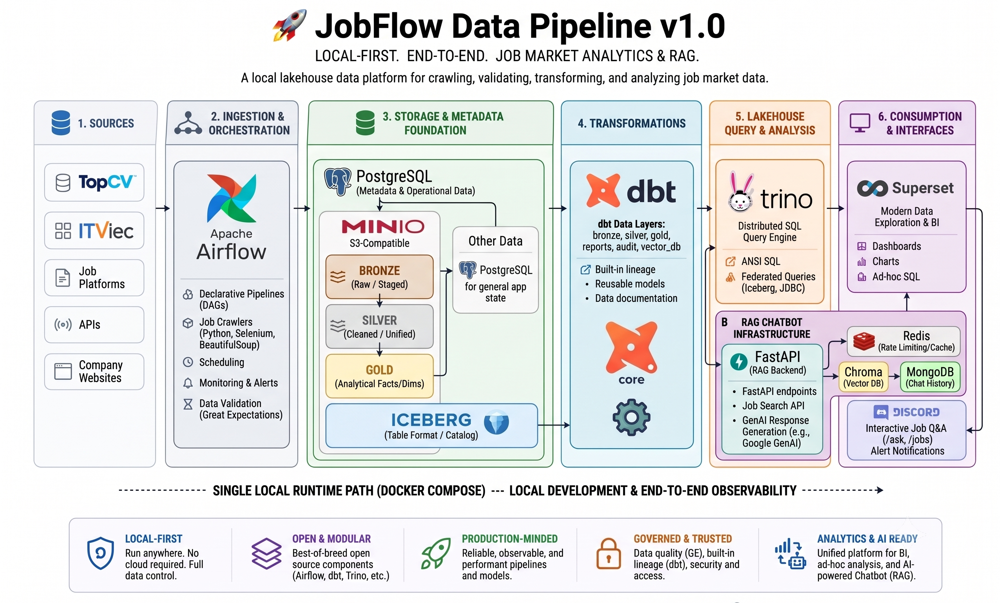
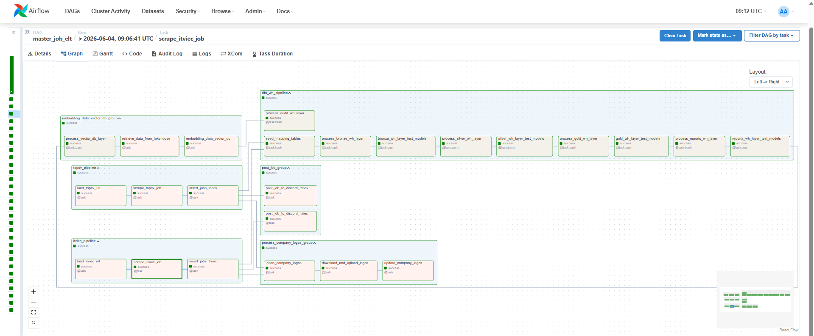
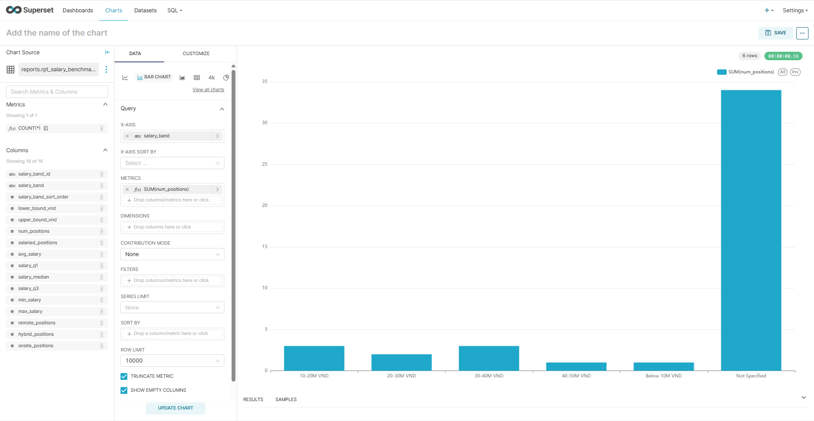
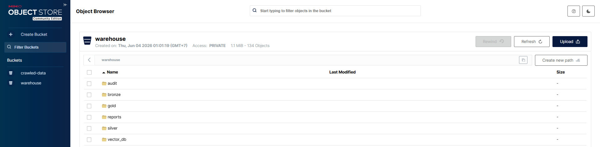
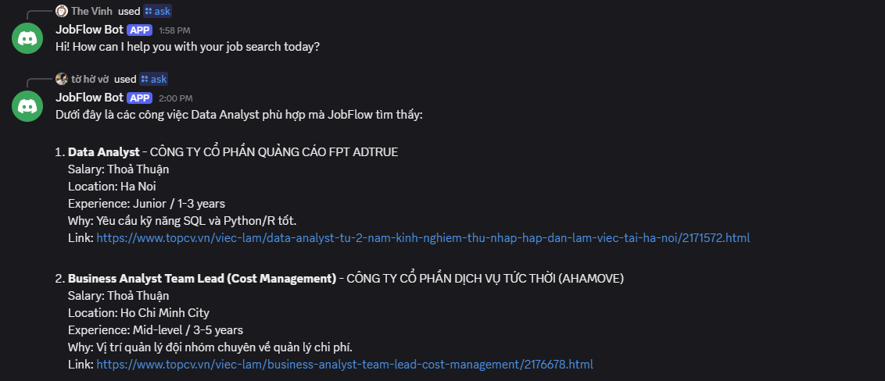
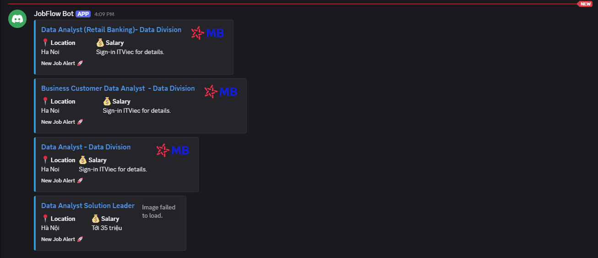

<div align="center">

# 🚀 JobFlow Data Pipeline

**A local lakehouse data pipeline for crawling, validating, transforming, and analyzing job market data.**


</div>

---

## 📌 Overview

JobFlow Data Pipeline is an end-to-end local data platform that collects job postings from job platforms, stores raw and processed data, validates data quality, and builds analytics-ready models for job market reporting.

The project follows a lakehouse-style workflow:

1. Crawl job data from sources such as **TopCV** and **ITViec**.
2. Store operational data in **PostgreSQL** and object data in **MinIO**.
3. Query warehouse tables through **Trino** with an **Iceberg** catalog.
4. Transform data with **dbt** across bronze, silver, gold, reports, audit, and vector layers.
5. Orchestrate everything with **Apache Airflow**.
6. Explore analytics through **Superset**.
7. Power optional chatbot/RAG flows with **Chroma**, **MongoDB**, **Redis**, **FastAPI**, and **Discord**.

---

## ✨ Features

- 🕷️ Job crawlers built with Python, Selenium, BeautifulSoup, and Requests.
- 🌬️ Airflow DAGs for ingestion, validation, image handling, dbt workflows, embedding, and Discord posting.
- 🧪 Data validation support with Great Expectations.
- 🪣 MinIO buckets for warehouse and crawled data storage.
- 🧊 Trino + Iceberg warehouse schemas for analytical querying.
- 🧱 dbt models organized by bronze, silver, gold, reports, audit, and vector layers.
- 📊 Superset BI service for dashboards and report-table exploration.
- 🐘 PostgreSQL bootstrap scripts for Airflow metadata, job data, and catalog metadata.
- 🧠 Chroma vector database for local vector search and embedding workflows.
- 🤖 FastAPI RAG backend for job-search chatbot responses.
- 🍃 MongoDB for chatbot conversation storage.
- ⚡ Redis for shared API rate limiting.
- 💬 Discord slash-command bot for interactive job Q&A.
- 🔔 Discord integration for job notification workflows.
- 🐳 Docker Compose setup for local development.

---

## 🏗️ Architecture



---

## 🧰 Tech Stack

| Category | Tools |
| --- | --- |
| Language | Python 3.12 |
| Workflow Orchestration | Apache Airflow 2.9.1 |
| Data Crawling | Selenium, BeautifulSoup, Requests |
| Data Quality | Great Expectations |
| Transformation | dbt Core, dbt-trino |
| Query Engine | Trino |
| Table Format / Catalog | Iceberg, JDBC catalog |
| BI | Apache Superset |
| Databases | PostgreSQL 16.4, MongoDB 8.0, Chroma 1.5.2, Redis 7.4 |
| Object Storage | MinIO |
| Apps | FastAPI, Discord.py |
| DevOps | Docker, Docker Compose, Makefile |
| Code Quality | Ruff, pytest, pre-commit |

---

## 📂 Project Structure

```text
.
├── apps/
│   ├── api/                  # FastAPI RAG backend for chatbot/job search
│   └── bot/                  # Discord slash-command bot
├── assets/                   # Demo screenshots
├── infra/
│   ├── airflow/
│   │   ├── dags/              # Airflow DAG definitions
│   │   ├── dbt_jobflow/       # dbt project and analytics models
│   │   ├── scripts/           # Crawlers, validation, utilities, source configs
│   │   ├── tasks/             # Reusable Airflow task groups and task helpers
│   │   ├── config/            # Airflow configuration
│   │   ├── Dockerfile         # Airflow runtime image
│   │   └── requirements.txt   # Airflow image dependencies
│   ├── chroma/                # Chroma vector database compose config
│   ├── minio/                 # MinIO object storage compose config
│   ├── mongodb/               # MongoDB compose config and chat collection bootstrap
│   ├── postgresql/            # PostgreSQL init scripts
│   ├── redis/                 # Redis compose config
│   ├── superset/              # Superset compose config and datasource bootstrap
│   └── trino/                 # Trino runtime, catalog config, and schema init
├── tests/                     # API, bot, and Airflow tests
├── docker-compose.yml         # Local platform entrypoint
├── Makefile                   # Common local commands
├── requirements.txt           # Local Python dependencies
└── .env.example               # Environment variable template
```

Folder-level documentation:

| Path | Documentation | What to read it for |
| --- | --- | --- |
| `apps/` | [`apps/README.md`](apps/README.md) | Application services overview and app runtime flow. |
| `apps/api/` | [`apps/api/README.md`](apps/api/README.md) | FastAPI endpoints, RAG logic, Chroma/MongoDB/GenAI settings. |
| `apps/bot/` | [`apps/bot/README.md`](apps/bot/README.md) | Discord slash commands, bot settings, API integration. |
| `infra/` | [`infra/README.md`](infra/README.md) | Infrastructure services, Compose files, platform data flow. |
| `infra/airflow/` | [`infra/airflow/README.md`](infra/airflow/README.md) | DAGs, dbt layers, crawlers, embedding flow, Airflow settings. |

---

## 🧱 dbt Data Layers

| Layer | Path | Description |
| --- | --- | --- |
| Bronze | `infra/airflow/dbt_jobflow/models/bronze` | Source-aligned staging tables. |
| Silver | `infra/airflow/dbt_jobflow/models/silver` | Cleaned and unified intermediate models. |
| Gold | `infra/airflow/dbt_jobflow/models/gold` | Facts and dimensions for analytics. |
| Reports | `infra/airflow/dbt_jobflow/models/reports` | Business-ready report tables for Superset. |
| Audit | `infra/airflow/dbt_jobflow/models/audit` | Pipeline performance and ELT summary models. |
| Vector DB | `infra/airflow/dbt_jobflow/models/vector_db` | Job text and metadata prepared for Chroma embedding. |

---

## 🌐 Services

| Service | URL / Port | Description |
| --- | --- | --- |
| Airflow Webserver | http://localhost:8080 | Manage DAGs and monitor pipeline runs. |
| Trino | http://localhost:8081 | SQL query endpoint mapped to container port `8080`. |
| Superset | http://localhost:8088 | BI dashboard and visualization UI for Trino/Iceberg report tables. |
| MinIO API | http://localhost:9000 | S3-compatible object storage API. |
| MinIO Console | http://localhost:9001 | Object storage web console. |
| Chroma | http://localhost:8000 | Vector database HTTP endpoint. |
| Chatbot API | http://localhost:8100 | FastAPI RAG backend for Chroma retrieval and GenAI responses. |
| PostgreSQL | `localhost:5432` | Metadata, job data, and catalog database. |
| MongoDB | `localhost:27017` | Chatbot message database. |
| Redis | `localhost:6379` | Rate-limit/cache service. |

---

## ⚙️ Configuration

Copy `.env.example` to `.env` before running locally. The default values are enough to start the Docker stack.

Only update the values you actually need, usually:

- `GOOGLE_API_KEY` and `GOOGLE_GENAI_MODEL` for chatbot answer generation.
- `DISCORD_BOT_ENABLED`, `DISCORD_TOKEN`, `DISCORD_GUILD_ID`, and `DISCORD_CHANNEL_ID` for Discord bot or alert posting.
- Host ports only if a local port is already occupied.

Detailed variable descriptions live in `.env.example` and the folder-level README files.

---

## 🚀 Quick Start

Requirements: Docker, Docker Compose, Make, and Python 3.12 for local checks.

```bash
git clone <repository-url>
cd jobflow-data-pipeline
make run
```

After the containers are healthy, open the services listed above. For Airflow, log in with `DB_USER` / `DB_PASSWORD` from `.env`.

---

## 🤖 Chatbot API and Discord Bot

The chatbot runtime is split into two services:

- `apps/api/`: FastAPI backend with `/health`, `/chat`, `/jobs/search`, and `/chat/history/{user_id}`.
- `apps/bot/`: Discord slash-command bot with `/ask`, `/jobs`, and `/reset`.

Before using `/ask`, make sure the embedding pipeline has populated Chroma and the chatbot variables in `.env` are configured.

For local development outside Docker:

```bash
make api-dev
make bot-dev
```

### Chatbot API Endpoints

Base URL when running through Docker Compose: `http://localhost:8100`

| Method | Endpoint | Purpose |
| --- | --- | --- |
| `GET` | `/health` | Check API dependency status for Chroma and MongoDB. |
| `POST` | `/chat` | Run full RAG chat: retrieve jobs, load history, call Google GenAI, save history. |
| `POST` | `/jobs/search` | Search Chroma and return matching jobs without calling the LLM. |
| `DELETE` | `/chat/history/{user_id}` | Delete stored MongoDB chat history for a user. |

Example `/chat` request:

```json
{
  "user_id": "discord-user-id",
  "message": "Co job Data Engineer o TP.HCM khong?"
}
```

Example `/jobs/search` request:

```json
{
  "query": "backend Python remote"
}
```

All chatbot responses include `sources`, `retrieved_jobs`, and `usage_context` so clients can inspect which job records were retrieved.

### Discord Bot Commands

| Command | Backend endpoint | Purpose |
| --- | --- | --- |
| `/ask question` | `POST /chat` | Ask a natural-language question and receive a grounded AI answer with job sources. |
| `/jobs query` | `POST /jobs/search` | Search matching jobs and show title, company, location, salary, and URL. |
| `/reset` | `DELETE /chat/history/{user_id}` | Clear the current Discord user's stored chat history. |

---

## ▶️ Running Pipelines

Start the platform with `make run`, open Airflow at http://localhost:8080, then trigger the main DAG:

```text
master_job_elt
```

The main DAG coordinates ITViec and TopCV crawlers, post-processing tasks, company logo processing, dbt warehouse transformations, and downstream embedding work.

Useful DAG ids:

| DAG | Purpose |
| --- | --- |
| `master_job_elt` | End-to-end orchestration. |
| `topcv_pipeline` | TopCV crawl pipeline. |
| `itviec_pipeline` | ITViec crawl pipeline. |
| `dbt_pipeline` | dbt transformation pipeline. |
| `embed_vector_db_pipeline` | Build vector-search rows and write embeddings to Chroma. |
| `post_job_elt` | Post unposted job alerts to Discord. |
| `image_processing_pipeline` | Process company logo/image assets. |

---

## 🔎 Querying Data

You can query the warehouse through Trino after the stack is running and initialization has completed.

Example from inside the Trino container:

```bash
docker compose exec trino trino --server http://localhost:8080
```

Example SQL:

```sql
SHOW CATALOGS;
SHOW SCHEMAS FROM iceberg;
SHOW TABLES FROM iceberg.gold;
SHOW TABLES FROM iceberg.reports;
```

---

## 🖼️ Demo Screenshots

| Airflow Master Pipeline | Superset BI |
| --- | --- |
|  |  |

| MinIO Object Store | Discord Chat Bot |
| --- | --- |
|  |  |

| Discord Job Alert |
| --- |
|  |

---

## 🗺️ Roadmap

- Add more documented example Trino queries.
- Expand crawler source documentation.
- Add dbt lineage screenshots or generated docs.
- Improve pipeline observability and alerting.
- Add production deployment notes.

---

## 📄 License

This project is licensed under the terms in [LICENSE](LICENSE).
