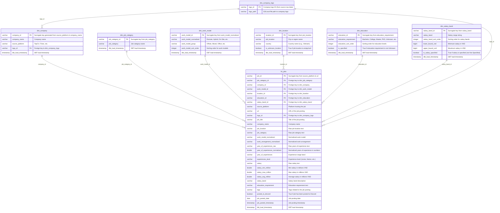

```mermaid
erDiagram
    dim_company ||--o{ fct_jobs : "company_id"
    dim_job_category ||--o{ fct_jobs : "job_category_id"
    dim_work_model ||--o{ fct_jobs : "work_model_id"
    dim_location ||--o{ fct_jobs : "location_id"
    dim_education ||--o{ fct_jobs : "education_id"
    dim_salary_band ||--o{ fct_jobs : "salary_band_id"
    dim_company_logo ||--o{ dim_company : "logo_id"
    dim_company_logo ||--o{ fct_jobs : "logo_id"

    dim_company {
        varchar company_id PK "Surrogate key generated from source_platform & company_name"
        varchar company_name "Company name"
        varchar source_platform "TopCV, ITviec, etc."
        varchar logo_id FK "Foreign key to dim_company_logo"
        timestamp dbt_load_timestamp "DBT load timestamp"
    }

    dim_company_logo {
        varchar logo_id PK "Company logo ID (from source raw data)"
        varchar logo_path "S3/Local file path to company logo"
    }

    dim_education {
        varchar education_id PK "Surrogate key from education_requirement"
        varchar education_requirement "Bachelor, College, Master, PhD, Unknown, etc."
        integer education_sort_order "Sorting order for education levels"
        boolean is_specified "True if education requirement is not Unknown"
        timestamp dbt_load_timestamp "DBT load timestamp"
    }

    dim_job_category {
        varchar job_category_id PK "Surrogate key from job_category"
        varchar job_category "Job category name"
        timestamp dbt_load_timestamp "DBT load timestamp"
    }

    dim_location {
        varchar location_id PK "Surrogate key from job_location"
        varchar job_location "City or region name"
        varchar country "Country name (e.g., Vietnam)"
        boolean is_unknown_location "True if job location is empty/null"
        timestamp dbt_load_timestamp "DBT load timestamp"
    }

    dim_salary_band {
        varchar salary_band_id PK "Surrogate key from salary_band"
        varchar salary_band "Salary range string"
        integer salary_band_sort_order "Sorting order for salary bands"
        bigint lower_bound_vnd "Minimum salary in VND"
        bigint upper_bound_vnd "Maximum salary in VND"
        boolean is_salary_specified "True if salary is specified (not Not Specified)"
        timestamp dbt_load_timestamp "DBT load timestamp"
    }

    dim_work_model {
        varchar work_model_id PK "Surrogate key from work_model_normalized"
        varchar work_model_normalized "Remote, Hybrid, On-Site, etc."
        varchar work_model_group "Offsite, Mixed, Office, etc."
        integer work_model_sort_order "Sorting order for work models"
        timestamp dbt_load_timestamp "DBT load timestamp"
    }

    fct_jobs {
        varchar job_id PK "Surrogate key from source_platform & url"
        varchar job_category_id FK "Foreign key to dim_job_category"
        varchar company_id FK "Foreign key to dim_company"
        varchar work_model_id FK "Foreign key to dim_work_model"
        varchar location_id FK "Foreign key to dim_location"
        varchar education_id FK "Foreign key to dim_education"
        varchar salary_band_id FK "Foreign key to dim_salary_band"
        varchar source_platform "Platform hosting the job"
        varchar url "URL of the job posting"
        varchar logo_id FK "Foreign key to dim_company_logo"
        varchar job_title "Title of the job posting"
        varchar company_name "Company name"
        varchar job_location "Raw job location text"
        varchar job_category "Raw job category text"
        varchar work_model_normalized "Normalized work model"
        varchar work_arrangement_normalized "Normalized work arrangement"
        varchar year_of_experiences_raw "Raw years of experience text"
        double year_of_experiences_normalized "Normalized years of experience in numbers"
        varchar year_of_experiences "Experience range band"
        varchar experiences_level "Experience level (Junior, Senior, etc.)"
        varchar salary "Raw salary text"
        double salary_min_million "Min salary in millions VND"
        double salary_max_million "Max salary in millions VND"
        double salary_avg_million "Average salary in millions VND"
        varchar salary_band "Salary band description"
        varchar education_requirement "Education requirement text"
        varchar tags "Tags related to the job posting"
        boolean posted_to_discord "True if job has been posted to Discord"
        date job_posted_date "Job posting date"
        timestamp job_posted_timestamp "Job posting timestamp"
        timestamp dbt_load_timestamp "DBT load timestamp"
    }
```
